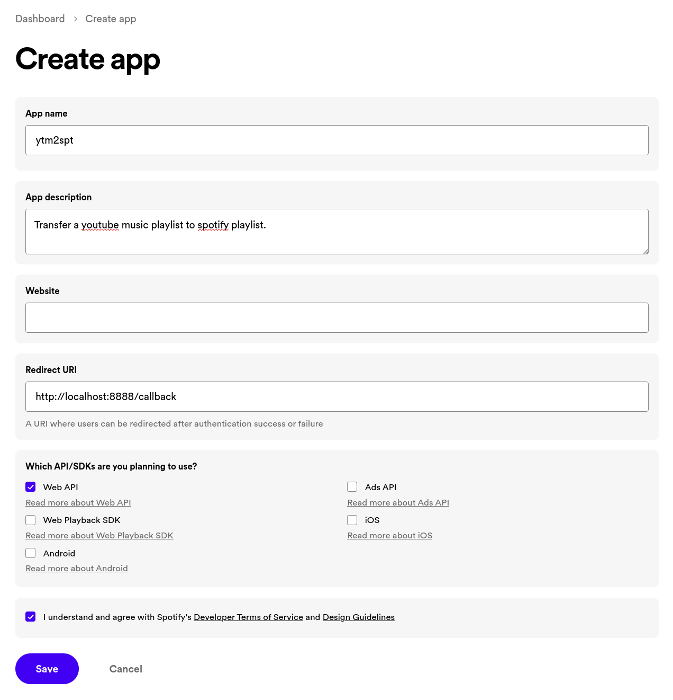
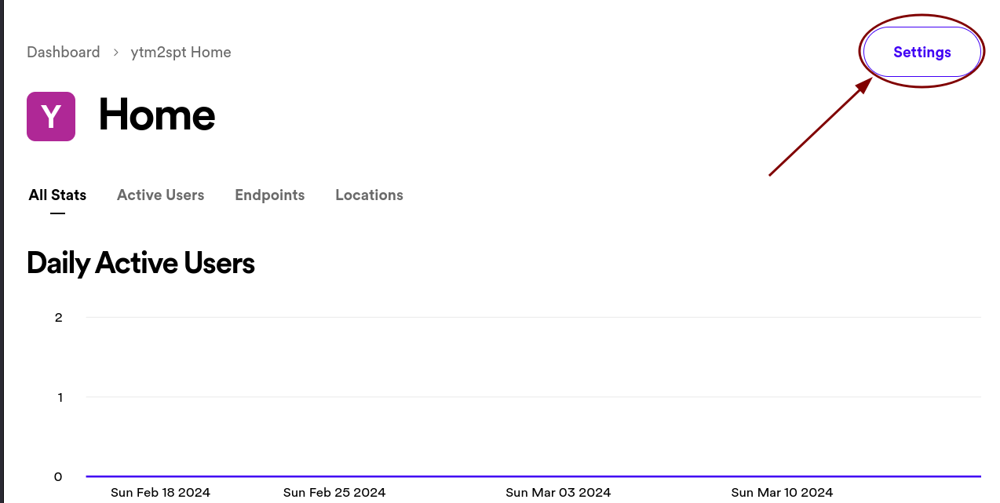
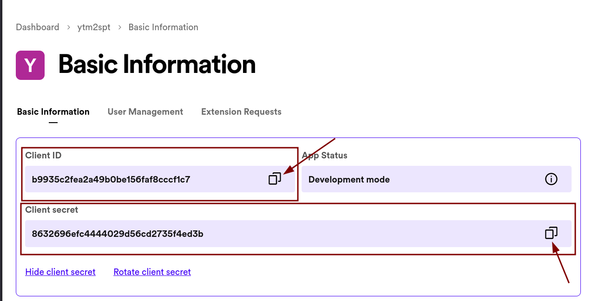
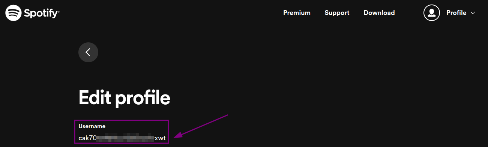

# YouTube Music To Spotify

Converts a youtube music playlist to spotify playlist.

- [x] Support public playlists
- [x] Support private playlists
- [x] Auto create or update playlist if it already exists
- [x] Use fuzzy search to find the best match
- [x] Copy playlist thumbnail from youtube to spotify
- [ ] Copy playlist description from youtube to spotify
- [x] Limit number of songs in the playlist
- [x] Dry run mode to test without adding to spotify


## Setup

### Spotify Developer Account

1. Create a new app: https://developer.spotify.com/dashboard
2. Set "Redirect URI" to `http://localhost:8888/callback`
   
3. Copy the "Client ID" and "Client Secret" to use later
   
   
4. Copy the "User ID" from your Spotify account: https://www.spotify.com/in-en/account/profile/
   

### Setting Environment Variables Linux and Mac

1. Rename the file `.env.sample` to `.env`
2. Edit the file by adding your credentials
3. Run the following command to set your environment variable: `source .env`


### Setting Environment Variables (Windows)

1. Edit `env.bat` file by adding your credentials in these lines
   ```bat
   set SPOTIFY_USER_ID=<your_user_id>
   set SPOTIFY_CLIENT_ID=<your_client_id>
   set SPOTIFY_CLIENT_SECRET=<your_client_secret>
   ```
2. Run the batch file to set your environment variable: 
   ```bat
   env.bat
   ```

>[!NOTE]<br>
> If the environment variables are not set, you may need to restart your terminal or IDE.

### Install Dependencies
```sh
pip install -r requirements.txt
```

### Youtube OAuth (Only for private playlists)

Run the following command to login to your Youtube account and save the credentials to `oauth.json`
```sh
ytmusicapi oauth
```

## Usage

```sh
$ source .env
$ python src/main.py -h
usage: main.py [-h] -yt YOUTUBE_URL_OR_ID
               [-sp SPOTIFY_URL_OR_ID | -spname SPOTIFY_PLAYLIST_NAME]
               [-ytauth YOUTUBE_OAUTH_JSON]
               [-n | -d] [-l LIMIT]

options:
  -h, --help            show this help message and exit
  -yt YOUTUBE_URL_OR_ID, --youtube-url-or-id YOUTUBE_URL_OR_ID
                        Youtube Playlist URL or ID
  -sp SPOTIFY_URL_OR_ID, --spotify-url-or-id SPOTIFY_URL_OR_ID
                        Spotify Playlist URL or ID
  -spname SPOTIFY_PLAYLIST_NAME, --spotify-playlist-name SPOTIFY_PLAYLIST_NAME
                        Spotify Playlist Name (Default: Youtube Playlist Name)
  -ytauth YOUTUBE_OAUTH_JSON, --youtube-oauth-json YOUTUBE_OAUTH_JSON
                        Youtube OAuth JSON filepath (run 'ytmusicapi oauth')
  -n, --create-new      Force create a new playlist
  -d, --dryrun          Do not add to Spotify
  -l LIMIT, --limit LIMIT
                        Limit the number of songs to fetch
```

### Examples

Sample Playlist: Pop Certified ([YouTube Music](https://music.youtube.com/playlist?list=RDCLAK5uy_lBNUteBRencHzKelu5iDHwLF6mYqjL-JU) to [Spotify](https://open.spotify.com/playlist/6DyIxXHMwuEMbsfPTIr9C8))

```sh
# Pass any link containing a youtube playlist ID
# Sets same name as youtube playlist
$ python src/main.py -yt "https://music.youtube.com/playlist?list=RDCLAK5uy_lBNUteBRencHzKelu5iDHwLF6mYqjL-JU"

# Pass just the youtube playlist ID
# Set a custom name for the playlist
$ python src/main.py -yt "CLAK5uy_lBNUteBRencHzKelu5iDHwLF6mYqjL-JU" -spname "Pop Certified"

# Pass link of a private youtube playlist
# Provide the path to the oauth.json file
$ python src/main.py -yt "https://music.youtube.com/playlist?list=PLz96m0PSfi9p8ABcEcUlSMVmz7sN-IEFu" -ytauth "oauth.json"

# Pass an existing spotify playlist URL or ID
# Limit the number of songs to fetch
# Dry run mode
$ python src/main.py -yt "CLAK5uy_lBNUteBRencHzKelu5iDHwLF6mYqjL-JU" -sp "https://open.spotify.com/playlist/6DyIxXHMwuEMbsfPTIr9C8" -l 10 -d

# Pass even the URL of video playing from playlist
# Force create a new playlist
$ python src/main.py -yt "https://www.youtube.com/watch?v=RlPNh_PBZb4&list=RDCLAK5uy_lBNUteBRencHzKelu5iDHwLF6mYqjL-JU" -n
```

> [!TIP]<br>
> If you find this project useful or interesting, please consider giving it a 🌟star! It helps others discover it too!


> [!NOTE]<br>
> Forked from @edgarh22's [Youtube-to-Spotify-Archiver](https://github.com/edgarh92/Youtube-to-Spotify-Archiver).
